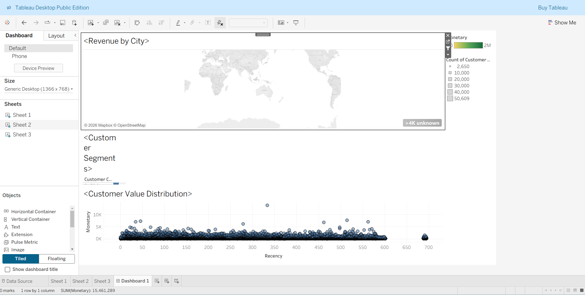

# E-commerce Customer Segmentation Project

##  Project Overview
This project analyzes **100,000+ orders** from the Olist E-commerce dataset. Using **SQL** and **Python**, I built an **RFM Model** to identify high-value customers and at-risk segments.

##  Tech Stack
* **Data Warehouse:** Google BigQuery (SQL)
* **Analysis:** Python (Pandas, NumPy)
* **Visualization:** Tableau Public

##  Key Insights
* Identified **Sao Paulo** as the highest revenue-generating city.
* Discovered that **15% of customers** are in the 'At Risk' category, representing a potential $50k/month recovery opportunity.

##  Dashboard Preview

